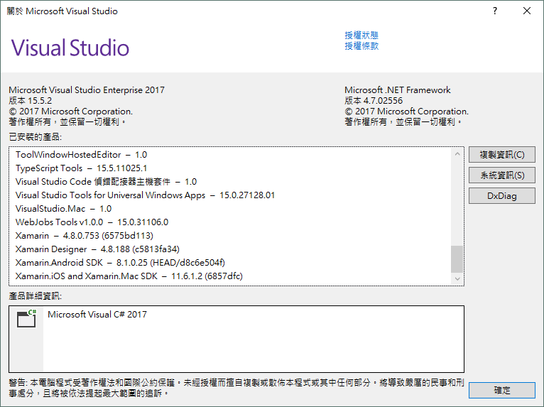
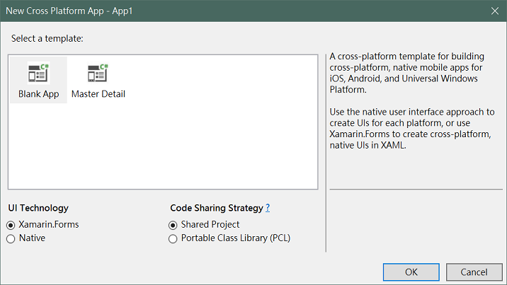
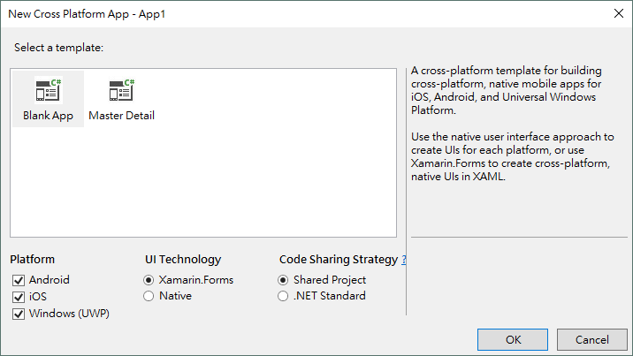

# 180106 在 Study4Love 與大師對談的 Lightning Talk
## 主題：.NET Standard 2.0 與 .NET Core Console App 與 Xamarin.Forms
　　
### 前言
主旨超級長一個。  
早上聽完 Vulcan 大大講「學習如何建立一個 Multi-targeted 的 .NET 程式庫」，就覺得是時候該實作一下，原本想說叫 12th MSP 上去講的，但每個都說手邊沒作品要怎麼講？突然覺得我應該要以身作則，趕快擠出一個小作品，上去分享一波，希望藉此感動 12th 的小朋友們。   
前言也很長。  
總之本次的目標是把早上第一場講座聽到的 .NET Standard 2.0 拿來套在 .NET Core 與 Xamarin.Forms 上面！  

### 踩雷分享
首先第一件事就是要知道自己所用的 .NET Standard 是哪個版本的（現在應該都是 2.0）以及你所要打的 Taget 有沒有實作 .NET Standard。講到這邊大家可能會驚訝，.NET Standard 不是一套全新的 Framework 嗎？為什麼說目標平台有沒有實作？但其實不是，Standard 就跟他的名字一樣，是一個「標準」，它存在的目的在所有的 .NET 實作上（e.g. .NET Core、.NET Framework...）提供一個正式的 API 規範，讓跨平台的實作更加容易。
　　
> The .NET Standard is a formal specification of .NET APIs that are intended to be available on all .NET implementations.  
> Ref. [.NET Standard](https://docs.microsoft.com/en-us/dotnet/standard/net-standard)  
  
好的，透過上面的參考文件顯示，若我們要在 Xamarin.Forms 以及 .NET Core Console APP 上共用我們所寫好的程式碼，[Xamarin.Forms 的版本要在 2.4 以上](https://developer.xamarin.com/guides/xamarin-forms/under-the-hood/net-standard/)、Xamarin.Android 8.0、UWP 10.0.16299 最後 .NET Core 則是 2.0。  

**版本確認**什麼的大家可以透過 VS 來檢查，如下圖：  
  
  
版本確認很重要喔！如果目標平台沒有支援的話就什麼事也不能做！在這邊跟大家分享我踩到的第一個雷：Xamarin.Forms 無法正常編譯。而且我還遇到兩次。  

第一次是因為自己沒注意到版本，所以我在 VS 15.3 的環境下照著[官方教學](https://developer.xamarin.com/guides/xamarin-forms/under-the-hood/net-standard/)來把 .Forms 的 UI 層移到 .NET Standard 上面，但是怎麼試都不成功才發現 VS 版本要更新到 15.4 以上，其他相依的工具才會把對 .NET Standard 的支援加進來。  
  
像是原先建立 Xamarin.Forms 專案的時候都會跳出讓你選擇建立 PCL or Shared Project 的選項都會被改成 Shared Project 與 .NET Standard 如下圖：  

  

  

所以大家可以不用再跟著官方文件從 PCL or Shared Project 把 UI 拉到 .NET Standard 裡囉！  

第二次則是不知道為什麼 Xamarin.Android 的專案會跟我說找不到關鍵字，總之按下清除專案之後就沒問題了呢！  

還有一次是寫完要跑 UWP 測試的時候，VS 噴了一個出現嚴重錯誤 0x8000fff，查了一下之後發現**貌似**跟 XAML 有關，總之就是先把加上去的 UI 拔掉就對了！  

恩，然後重來一次就沒問題了...

### 後記
很簡單的一個分享，因為 .NET Core 2.0 以及新版的 Xamarin.Form 都已經支援 .NET Standard 2.0 所以在共用程式碼上面並不會有太多的問題，唯一的問題大概就是環境了吧哈哈哈哈哈。  

以上。  
分享於 180106 Study4Love 與大師對談 Lightning Talk。  
我是 EP 謝謝大家 :D